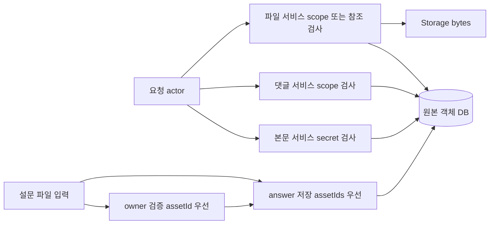
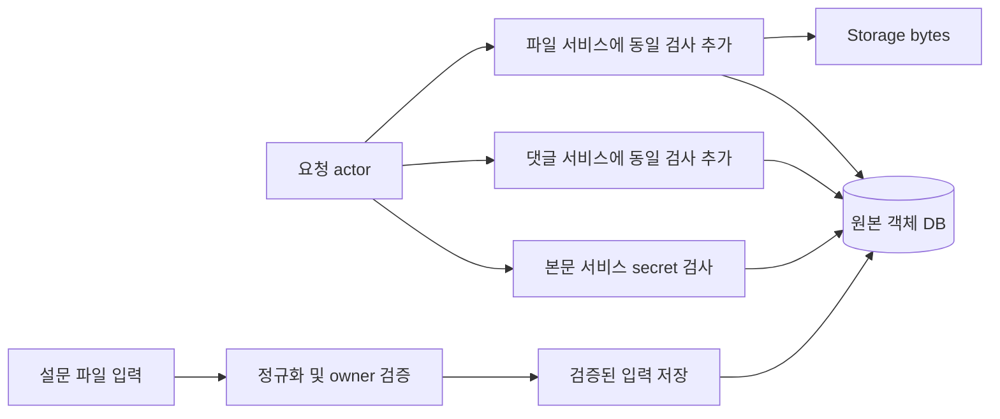
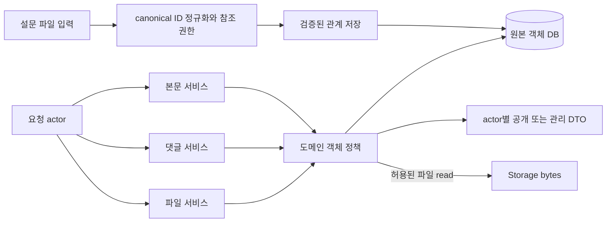

# Security Hardening Proposal: 객체 접근 정책과 파일 참조 정규화

## Decision

동일 게시글의 본문·댓글·파일이 같은 접근 조건을 따르고, 파일의 검증 대상과 저장 대상이 같도록 도메인 내부의 정책 경계를 공통화한다. 새 인증/정책 서버를 배포하는 제안이 아니다.

## Executive Recommendation

선택지는 **Option 1: 현재 경로별 검사 보강**, **Option 2: 도메인 공통 정책과 canonical 파일 참조**다. 나는 Option 2를 권장한다. 우리는 현재 정상 작동하는 본문 접근 규칙을 재사용하면서 다른 sink에서 검사를 빠뜨릴 가능성을 낮출 수 있다. 긴급 차단이 필요하면 Option 1의 국소 패치를 먼저 적용하고 같은 테스트를 유지하며 이동한다.

## Evidence

아래는 [E01 — 보안 상세 결과](../../../docs/SECURITY_AUDIT_RESULTS_2026-09-08.md)의 finding을 사람이 읽을 수 있는 이름과 연결한 것이다. E01은 이번에 다시 실행한 exploit 결과가 아니라 입력 증거다.

| Evidence | Finding or document | What it establishes |
| --- | --- | --- |
| S05-F01 | 익명 작성자 raw DTO | 보고서 하네스에서 공개 응답에 작성자 신원 포함. 현재 article repository의 author mapping과 secret-only masking 확인 |
| S05-F02 | 비밀글 댓글 접근 | 현재 CommentService는 scope-readable 검사 사용. 본문의 secret 검사와 다름 |
| S05-F03 | 비밀 이전/다음 글 metadata | 보고서에서 neighbor 제목·author pass-through. 공통 DTO 정책의 추가 적용 지점 |
| S06-F01 | 비밀 첨부파일 bytes | 현재 AssetService.getFile이 scope-readable만 확인한 뒤 storage.read에 도달 |
| S07-F02 | 혼합 assetId/assetIds | 현재 owner 검증은 assetId 우선, answer 검증은 assetIds 우선으로 해석 |
| S07-F03 | 설문 이미지 공개 승격 | 보고서의 ownership 부재와 현재 publicContentImage로 file read를 허용하는 sink |

**Observed:** 나는 `apps/api/src/features/board/article.service.ts:61`, `comment.service.ts:78`, `repositories/article.repository.ts:1190`, `features/asset/asset.service.ts:290` 전후를 읽었다. 본문에는 secret 작성자/운영진 규칙이 있고 scope-only SQL에는 isSecret 조건이 없다. `features/surveys/survey-responses.service.ts:58`과 `survey-answer-validation.ts:296`의 필드 우선순위도 반대다. 현재 API는 보고서 commit 이후 바뀌지 않았다.

**Inferred:** 단일 객체의 confidentiality와 file reference 의미가 호출자별 관례로 관리되므로 신규 기능에서 같은 누락이 반복될 가능성이 있다. 이 구조적 판단은 현재 production 피해자 데이터가 유출됐다는 주장과 별개다. 전체 여섯 경로의 새 HTTP exploit을 이번에 재실행하지 않았다.

## Current Design And Failure Mode

현재 본문 서비스는 board/readable scope를 넘어서 비밀글 작성자와 허용 운영진을 판별한다. 댓글과 첨부파일은 같은 객체를 다루면서 더 약한 readability query를 호출한다. guard에 로그인/기능 권한을 추가하는 것만으로는 A/B 사용자 간 객체 경계를 복구할 수 없다. 공통화의 대상은 전역 “로그인됨”이 아니라 최종 게시글의 원본 접근 metadata다.

설문 파일 문제는 입력 의미의 소유권 문제다. owner check와 답변 validation이 같은 JSON을 다르게 읽는다. 관리 DTO나 public reference가 그 잘못된 입력을 정상 파일 관계로 취급하면 별도 공개 경로까지 영향을 받는다. 따라서 다운로드만 차단하는 보완과 저장 전에 잘못된 관계를 거부하는 보완이 모두 필요하다.

## Desired Invariants

- 게시글 본문을 볼 수 없는 actor는 해당 댓글/연결 파일의 내용에도 도달하지 않는다. 댓글 mutation은 별도 쓰기 권한까지 만족해야 한다.
- 원본 ID로 authorization을 계산하고 actor별 DTO projection을 적용한다. anonymization된 DTO를 authorization 입력으로 재사용하지 않는다.
- 파일 입력은 정규화된 하나의 ID 집합이며 검증된 집합과 저장된 집합이 같다.
- private file은 권한 없는 reference 생성만으로 public file이 되지 않는다.
- 권한 거부는 bytes read 및 부수효과 이전에 발생한다. 정상 작성자/허용 운영진 동작은 보존한다.

## Constraints And Non-Goals

현재 DB와 API 구조를 유지한다. 비밀글에서 WRITE_REPLY/MODERATE_CONTENT가 갖는 기존 의미는 명시적으로 테스트한다. 권한 의미를 변경하려면 별도 migration 판단을 한다. file owner·공개 재사용·legacy reference 호환을 함께 검토한다. session revoke, SMTP, vote cutoff, Google ACL은 이 제안의 해결 범위가 아니다.

## Before Architecture

## Options

### Option 1: 현재 경로별 검사 보강

이 대안의 장점은 배포 범위가 작다는 점이다. 댓글과 asset service에 본문과 같은 검사를 붙이고, public mapper에서 익명 필드를 제거하고, 설문 입력을 검증 전에 한 형태로 고친다. 우리는 현재 public API 형태를 최대한 유지하면서 바로 회귀 테스트를 통과시킬 수 있다. 소수 endpoint를 빠르게 막아야 하는 상황에는 합리적이다.

그러나 endpoint마다 판단 책임을 유지하면 새 export/search/comment 경로도 같은 guard 조합을 다시 기억해야 한다. 정상 동작을 보존하려면 duplicated policy의 테스트까지 함께 유지해야 한다. 데이터 모델 변화는 작고 rollback도 국소적이지만, 보안 패치를 롤백해 원래 누락을 되살리는 대신 영향을 받는 기능을 잠시 제한해야 한다.

추가 정책 조회로 지연과 query 수가 늘 수 있다. 현재 호출이 이미 metadata를 읽는 경우 재사용할 수 있어 메모리 비용은 제한적이라고 예상하지만 아직 측정하지 않았다. 운영 측면에서는 새 process 없이 denial code와 테스트를 보강하면 된다. 보안 효과는 “현재 고친 caller”에 국한되고 반복 누락 위험이 남는다.

| Change | Before | After | Security consequence | Cost |
| --- | --- | --- | --- | --- |
| 댓글/파일 | scope 검사 | 각 caller에서 secret 검사 추가 | 현재 누락 차단 | 조건 중복 유지 |
| 설문 입력 | 두 필드 해석 분산 | service에서 정규화 | 검사/저장 불일치 차단 | legacy client test |
| 공개 author | raw fields | local public mapper | 익명 정보 축소 | 모든 mapper 조사 |

이 대안에서도 파일 publish/reference 검사는 직접 추가해야 한다. 읽기 검사만 추가해 잘못된 관계를 DB에 계속 쌓는 것은 완료가 아니다.

### Option 2: 도메인 공통 정책과 canonical 파일 참조

우리는 원본 객체의 접근 context를 로드하는 좁은 API와 순수한 정책 판단 함수를 도메인 안에 둔다. 서비스는 이 결과로 본문·댓글·파일의 허용 여부를 결정하고 반환 직전에 public/admin mapper를 선택한다. controller의 기능 권한은 그대로 남는다. 권한 서비스가 모든 SQL을 대신하는 거대한 새 framework는 만들지 않는다.

설문 입력은 계약 경계에서 두 표현을 거부/정규화한 뒤 readonly canonical IDs를 owner check·persist에 전달한다. 파일 attach/publish도 검증된 관계만 저장하게 하며, 기존 불법 reference는 inventory와 read guard로 다룬다. 관계 생성과 read를 함께 소유하면 publicContentImage 같은 파생 flag만으로 원래 권한을 건너뛰는 위험을 줄일 수 있다.

이 설계의 가장 큰 비용은 호환성이다. 댓글·파일 서비스가 같은 metadata와 규칙을 사용하도록 바꾸는 동안 정상 운영진 권한, multiple link 공개 의미, 익명 DTO와 authorization 순서를 유지해야 한다. 우리는 shared contract와 client를 함께 변경하고, actor/resource matrix를 그대로 통과시키는 방식으로 도입한다. 새 오류 코드/거부 건수는 PII 없이 관찰한다.

네트워크 hop이나 별도 process는 늘지 않는다. metadata batch 조회와 request 내부 재사용으로 N+1을 피할 수 있지만 공통 함수의 오류는 여러 경로를 동시에 막을 수 있다. 따라서 유닛 테스트뿐 아니라 저장소와 파일 sink를 포함한 통합 테스트가 필요하다. 요청 밖의 오래된 authorization cache를 새로 추가하지 않아 철회/상태 변경을 숨기지 않는다. 메모리 비용은 metadata 집합 크기로 제한하고 대량 list에서는 explicit page cap을 유지한다.

롤아웃은 국소 차단이 있는 상태에서 caller를 한 계열씩 옮기는 방식이 적합하다. 이행 중 원본 policy와 새 policy가 다르면 더 느슨한 쪽을 선택하지 않는다. public DTO 변경으로 클라이언트가 깨지는 경우에도 신원 필드를 복원하는 대신 해당 UI 소비자를 고친다. 단기 deadline이 공통화 검증 시간을 허용하지 않으면 Option 1을 임시 상태로 쓰고 남은 caller 목록을 완료 조건에 남긴다.

| Change | Before | After | Security consequence | Cost |
| --- | --- | --- | --- | --- |
| 객체 제어 소유권 | service별 의미 다름 | 도메인 원본 policy 공유 | 현재 sink와 신규 caller의 불일치 감소 | metadata/호출 API 정리 |
| 반환 데이터 | raw record 일부 masking | actor별 명시 DTO | identity/metadata 누락 가능성 축소 | contracts/client 동시 전환 |
| 파일 관계 | 입력 표현·ref flag 분산 | canonical IDs + attach/publish 권한 | 미검증 대상 저장/공개 승격 차단 | 기존 reference inventory |

공통 policy는 허용의 근거를 한 곳에 둔다. 그렇더라도 새 endpoint가 그것을 사용하지 않으면 우회가 재발하므로 route inventory와 sink 통합 테스트를 계속 유지한다.

## Comparison

아래 효과는 측정값이 아닌 소스 기반 예상이다. 성능/메모리는 동일 fixture에서 측정한 뒤 확정한다.

| Dimension | Option 1 | Option 2 | Validation |
| --- | --- | --- | --- |
| Security | 현재 경로 직접 수정, 중복 관례 잔존 | 공통 제어/정규화, 누락 caller 위험 잔존 | actor×resource×sink 부정/정상 matrix |
| Performance | 추가 query 가능 | batching 가능, 공통 metadata 조회 비용 | p50/p95·SQL/Redis count 비교 |
| Memory | 제한된 임시 context | batch/page 크기 context | peak RSS·page cap |
| Reliability | 영향 경로 작음 | 공통 정책 결함의 영향 범위 큼 | storage/DB failure와 정상 운영진 test |
| Operability | 새 서비스 없음, 검사 중복 유지 | 새 서비스 없음, denial 원인 통일 | PII 없는 trace·신규 endpoint review |
| Migration | 작은 patch, 빠른 차단 | contracts/ref inventory/caller 이동 필요 | 단계별 integration와 client smoke |
| Developer drift | 같은 규칙 복제 유지 | 정책 변경 지점 감소 | raw sink/우회 caller 검색 |
| Rollback | 국소 변경 가능 | caller별 이행 되돌림 가능 | privacy guard 유지/기능 제한 |

## Recommendation

나는 Option 2가 현재 반복된 증거에 비례하는 선택이라고 판단한다. 우리는 별도 보안 microservice의 지연/배포/장애 부담을 추가하지 않고 통제의 소유권을 정리할 수 있다. 서로 독립된 인증·메일·투표 상태 기계까지 이 모듈에 끌어들이면 비용이 커지므로 H02~H09에서 국소적인 상태 전이 개선으로 처리한다.

## Evidence Coverage And Residual Risk

| Evidence | Option 1 | Option 2 | Tactical fix |
| --- | --- | --- | --- |
| S05-F01 — 익명 author DTO | addresses | addresses | public mapper 필수 |
| S05-F02 — 비밀 댓글 | addresses | addresses | 부모 access gate 필수 |
| S05-F03 — secret neighbor | addresses | addresses | neighbor filter/mask 필수 |
| S06-F01 — 비밀 asset bytes | addresses | addresses | storage 이전 gate 필수 |
| S07-F02 — 혼합 ID | addresses | addresses | canonical 입력 강제 필수 |
| S07-F03 — 이미지 공개 승격 | addresses | addresses | attach/publish ownership 필수 |

여기서 addresses는 제안된 작업을 모두 구현했을 때의 목표다. 현재 해결됐다는 뜻이 아니다. production 피해 정도, 기존 파일 관계의 부적절한 공유, 운영진 실제 권한 정책은 남는다. 나머지 37건은 이 구조 변경만으로 해결되지 않으며 [43건 지시서](../implementation/domain-policy.md)에 개별 처리 방식을 매핑했다.

## Migration And Rollout

긴급 gate/test → 원본 metadata context와 순수 policy → 댓글/asset caller 이동 → canonical 입력/참조 생성 → public DTO/client 전환 → legacy reference inventory 순서다. DB 내용을 임의 삭제하지 않고 적용 후 원래 취약 경로를 다시 검증한다. 운영 비밀값과 실제 외부 파일을 재현 자료로 사용하지 않는다.

## Validation Plan

H00의 격리 DB, A/B/guest/관리 역할 fixture와 local storage spy를 사용한다. 거부 시 HTTP status뿐 아니라 storage read/DB write/notification side effect가 없는지 검사한다. 정상 공개·작성자·허용 운영진 경로를 같이 테스트한다. 기존과 동일 dataset에서 query 수/지연/RSS를 비교하며 새 N+1·unbounded materialization은 허용하지 않는다.

## Implementation Work Packages

[domain-policy 구현 지시서](../implementation/domain-policy.md)의 H00/H01/H04가 이 제안의 도입 단계다. 나머지 H02/H03/H05~H09는 별도 결함의 패치와 통합 검증을 제공한다. 각 finding의 수정 파일·원래 실패·수정 후 성공·운영 미확인을 RESULTS.md에 남긴다.

## Open Questions

공개 연락처 필드, system admin/위임 ceiling, 다중 asset reference의 합법적 재사용은 지시서에 보수적 기본안을 제시했다. 기존 계약과 실제로 충돌하는 경우 해당 migration을 좁혀 확인한다. API 정책 공통화 자체를 시작하기 위해 전체 운영 정책 답변을 기다릴 필요는 없다.
